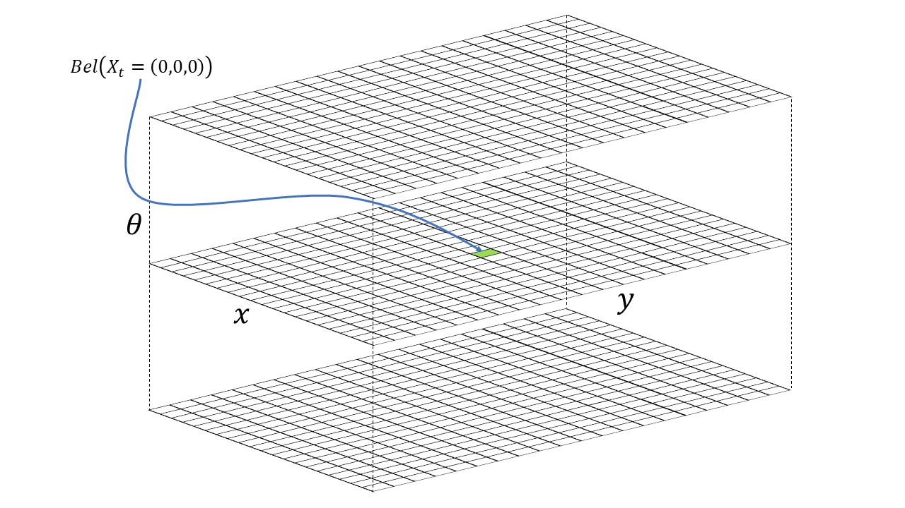
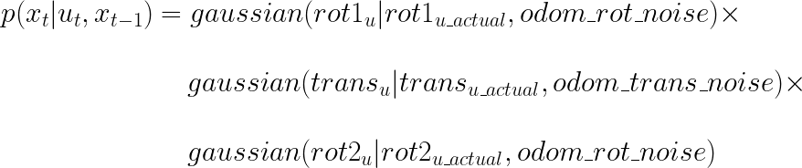

# Fast Robots @Cornell, Spring 2023

[Return to main page](index.md)

# Lab 10: Grid Localization using Bayes Filter

## Objective
The purpose of this lab is to implement grid localization using Bayes filter.

## Pre-lab

Please read the following background information and the lab description in its entirety before showing up to lab hours.  

#### Robot Localization
Robot localization is the process of determining where a mobile robot is located with respect to its environment. Plotting odometry against the ground truth in the previous lab should have convinced you that non-probabilistic methods lead to poor results.

#### Grid Localization
The robot state is 3 dimensional and is given by .
The robot's world is a continuous space that spans from:
- [-1.6764, +1.9812) meters or [-5.5, 6.5) feet in the x direction,
- [-1.3716, +1.3716) meters or [-4.5, +4.5) feet in the y direction,
- [-180, +180) degrees along the theta axis. 

<details>
  <summary><strong>What's with the imperial units?</strong></summary>
    We are using the floor tiles in the lab for discretization and each tile is 1 feet. It helps with visually tracking the discretized robot pose. All the quantities in the simulation base code are expressed in S.I. units, unless stated otherwise.
</details><br>

There are infinitely many poses the robot can be at within this bounded space. We thus discretize the continuous state space into a finite 3D grid space, where the three axes represent ,  and . This reduces the accuracy of the estimated state as we cannot distinguish between robot states within the same grid cell, but allows us to compute the belief over a finite set of states in reasonable time.

The grid cells are identical in size. The size of each grid cell (i.e resolution of the grid) along the ,  and  axes are  0.3048 m, 0.3048 meters and 20 degrees, respectively. The total number of cells along each axis are (12,9,18). Each grid cell stores the probability of the robot's presence at that cell. The belief of the robot is therefore represented by the set of probabilities of each grid cell and these probabilities should sum to 1. The Bayes filter algorithm updates the probability of the robot’s presence in each grid cell as it progresses. The grid cell(s) with the highest probability (after each iteration of the bayes filter) represents the most probable pose of the robot. Thus the most probable cell across different time steps characterizes the robot’s trajectory.


##### 3D Grid Visual Example
The image below depicts an example of a 3D grid with (20,20,18) cells.

<p align="center"></p>

The robot is initialized with a point mass distribution at (0,0,0) which translates to the grid cell index (10, 10, 9). This can be calculated using the grid resolution, grid size, and the fact that indices start from 0. The initial probability at the grid cell index (10, 10, 9) is 1.0 and every other cell has a value of 0. The green cell depicts the grid cell index (10, 10, 9). The top, middle and bottom x-y grid planes depict all the discrete robot states where the third index is 0, 9 and 17, respectively.

#### Sensor Model
We utilize a Gaussian Distribution to model the measurement noise. This can be thought of as a simplified version of the Beam model where we ignore the remaining three distributions used to model failures, unexpected objects, and random measurements. This simplified model works surprisingly well for laser range finders operating in static, indoor environments. Refer [lecture 18](lectures/FastRobots-18-SensorModel.pdf).

#### Motion Model
You should utilize the odometry motion model for this lab. At every time step, we can record the odometry data before and after the movement.
This relative odometry information can be described by the motion parameters: `rotation1, translation and rotation2`. 
You can use the Gaussian Distribution to model the noisy control data in the odometry motion model. Refer [lecture 17](lectures/FastRobots-17-Motion_models.pdf).

#### Bayes Filter Algorithm
Essentially, every iteration of the Bayes filter has two steps: 
   -  A prediction step to incorporate the control input (movement) data
   -  An update step to incorporate the observation (measurement) data

The prediction step increases uncertainty in the **belief** while the update step reduces uncertainty. The belief calculated after the prediction step is often referred to as **prior belief**. Refer [lecture 16](lectures/FastRobots-16-Markov_BayesFilter1.pdf) and [lecture 17](lectures/FastRobots-17-Motion_models.pdf).

---

## Lab Procedure
1. Download the lab10 notebook from [here](https://github.com/CEI-lab/FastRobots-2023/raw/main/docs/lab10.ipynb.zip) and copy *lab10.ipynb* into the **notebooks** directory (inside the simulation base code directory).
2. Follow the instructions in the notebook.

> NOTE: Make sure you read the [Tips](Lab10.md#tips) section after you go over the notebook instructions.

### Tasks
Perform Grid localization for the sample trajectory. 
- You may modify the trajectory for better results. 
- Attach a video of the best localization results (along the entire trajectory). 

### Workflow Tips
- At all times, make sure only ONE instance of the plotter and simulator is running. Avoid running multiple simulation notebooks concurrently.
- If the plotter becomes sluggish over long operating times, restart it.
- There is a small "A" button on the bottom left corner of the plotter tool that zooms the plot to fit in the window.
- Use <TAB> for code completion in Jupyter Lab.
- There is a lot of information in the jupyter notebook. You can collapse a cell by clicking on the blue vertical bar to the left of cell, when you hover the mouse over it.
- Consider creating a copy of the base notebook and remove/collapse unnecessary cells.

### Implementation Tips
Implementation in robotics can be a daunting task with multiple sub-objectives. It is always a good idea to list out the sub-objectives for your task and modularize your code accordingly. The Jupyter notebook provides you with a skeleton code and some helper functions. Test out some of these functions (**to_map**, **from_map**, **normalize_angle**) individually to get a hang of the larger code base.

#### Useful Python Functions
Use the python module **math** to import various functions such as **degrees**, **radians**, **cos**, **sin**, **tan2**, **hypot**, etc. [Refer [math module functions](https://docs.python.org/3/library/math.html)]

Use the python module **numpy** for Numpy operations such as basic slicing and indexing, functions such as **sum()**, **cos**, **sin**, **tan2**, **arctan2** and operators such as **+** and **\*** . [Refer [numpy math functions](https://numpy.org/doc/stable/reference/routines.math.html)]

**NOTE:** Most of these functions use radians as the default unit.

##### Gaussian Function
The **gaussian** function of class **BaseLocalization** can be used to model noise. It is advised to use Gaussians in the continuous world as it may be more involved to use Gaussians in a discretized world. Use the member functions **from_map** and **to_map** of class **Mapper** accordingly.

##### Arithmetic Underflow
When you multiply probabilities with each other (especially in the update step), the resulting value may suffer from [floating point underflow](https://en.wikipedia.org/wiki/Arithmetic_underflow). To prevent this from happening normalize the belief grid when necessary using the following code:
```
loc.bel = loc.bel / np.sum(loc.bel)
```
Think about how often you need to do this; every matrix operation takes time.

##### Odometry Motion Model in the Prediction Step
In the odometry motion model, any control input `u` can be expressed as a tuple <span></span>

The `compute_control` function is expected to extract the control information in the above format given a previous pose (at time `t-1`) and a current pose (at time `t`) of the robot.

`actual_u = compute_control(cur_odom, prev_odom)`, where `cur_odom` and `prev_odom` are the actual odometry readings extracted from the robot sensors before and after the robot motion at time `t`. Although this will be a noisy estimate of `u`, it is better than no prior at all!

Now that you have the `actual_u`, you need to incorporate the effects of this motion into the belief of the robot (from time `t-1`). You can compute what is the "necessary control action" `u` required for some arbitrary set of previous pose and current pose using the same function i.e `compute_control(cur_pose, prev_pose)`. 

Now, we have the `actual_u` and a `u` for a pair of possible previous and current poses of the robot. We can "plug" these into a Gaussian function to see how "probable" is the transition of the robot state from `prev_pose` to `current_pose` given the actual control action is `actual_u`. 

<p align="center"></p>

where, `gaussian` is a function defined in **localization.py**, `odom_rot_noise` and `odom_trans_noise` are variables defined in **localization.py**, and <span></span> is the transitional probability of a robot from a previous state <span></span> to the current state <span></span> given the current input <span></span>. The above equation is essentially what the function `odom_motion_model(cur_pose, prev_pose, u)` should implement.

All the quantities in the RHS (Right Hand Side) of the above equation is known, and thus you can calculate the transition probability <span></span> which is the only unknown quantity in the prediction step of the Bayes Filter. Repeat this for every possible pair of previous and current poses (the first line of the Bayes Filter algorithm) to complete the prediction step.

##### Sensor Model with multiple individual measurements
Each measurement  consists of 18 different individual measurements  recorded at equidistant angular positions during the robot's (anti-clockwise) rotation behavior. The 18 true measurements values are recorded at the same equidistant angular positions for each grid cell (state) and is available through the **Mapper** class. Therefore, each index of the member variable array **obs_views** (of class **Mapper**) is the true individual measurement of the corresponding index of the member variable array **obs_range_data** (of class **BaseLocalization**). You do not need to use **obs_bearing_data** in your bayes filter implementation.

You will need to find the likelihood of the 18 measurements given a state i.e.

<p align="center"></p>

In the above equation, we assume that individual measurements are independent given the robot state. 

##### Normalizing your angles
The third dimension of the grid represents the orientation (yaw) in the range \[-180,+180\) degrees. When dealing with angles in your bayes filter (for example in calculating rotation1 and rotation2 in the odom motion model), you need to make sure the final angles are in the above range.

Think about what happens when you use a Gaussian to model a rotation of 350 degrees where the true value is -10 degrees and standard deviation is 20 degrees.  is highly unlikely though 350 degrees is equivalent to -10 degrees. 

Use the function **normalize_angle** from class **Mapper** to normalize your angles when necessary.

##### Computation Time
In each iteration of the bayes filter, you will need to go through all possible previous and current states in the grid to estimate the belief. Think about how many loops would be required to perform this.

Given that your grid has 12×9×18 = 1944 possible states, there is lot of computation involved in each iteration of the bayes filter. Hence, you need to write efficient code, especially in Python, if you want your entire estimation process to run within a couple of minutes. Try to get the running time of the prediction step and the update step functions to be within a couple of seconds; shorter running times may prove beneficial for testing and debugging. Here are some ways to reduce processing time:
   - If the probability of a state (i.e grid cell) is 0, then we can skip that grid cell in the inner loops of the prediction step of the bayes filter. (i.e only in multiplicative terms, since multiplying any value with a 0 results in a 0). In fact, if a state has a probability less than `0.0001`, we can skip those states as they don't contribute a lot to the belief and thus can reduce the computation time. Note that since you are skipping some states, the sum of the probabilities across the grid may no longer sum to 1. So you will need to make sure you normalize at the end of your prediction step and update step (which you already do as per the algorithm).
   - Reduce unnecessary interim variables. This can lead to slow processing times, especially in Python. 
   - Use Numpy for faster matrix operations instead of element wise operations. Numpy is faster if you can use matrix-like operations because the backend processing happens in C. 
      - **HINT**: The **gaussian** function of class BaseLocalization can handle Numpy variables; think about how to perform Numpy operations in the update step. You may not even need the **sensor_model** function if you perform grid indexing to directly compute the sensor noise model in the **update_step** function.

---
  
## Write-up
To demonstrate that you've successfully completed the lab, please upload a brief lab report (<600 words), with code (not included in the word count), photos, and videos documenting that everything worked and what you did to make it happen. Include the most probable state after each iteration of the bayes filter along with its probability and compare it with the ground truth pose. Write down your inference of when it works and when it doesn't.

Please use screen-recording tools to record any necessary media.
