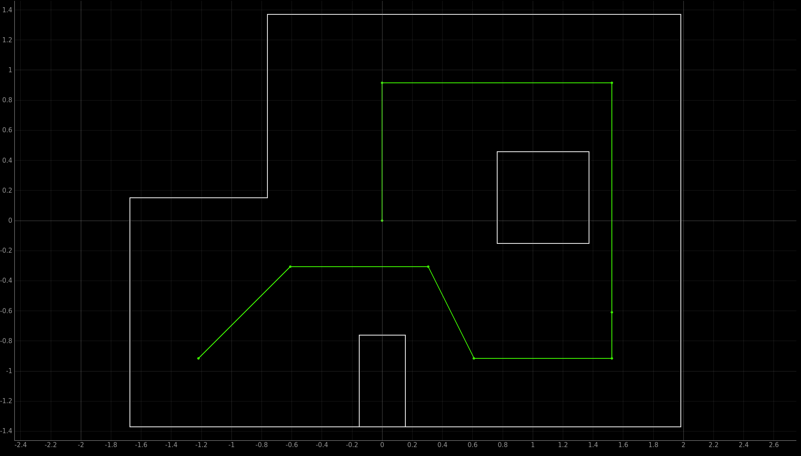

# Fast Robots @Cornell, Spring 2023

[Return to main page](index.md)

# Lab 12: Path Planning and Execution

## Objective
_Congratulations!_ You have built a robot (Labs 1, 3-5) with debugging capability (Labs 2) and closed loop control (Labs 6-8). You've shown its ability to map its environment (Lab 9), and to localize within it (Labs 10-11). The final piece of puzzle is to have the robot navigate through a set of waypoints in that environment as quickly and accurately as possible. 

This lab is intentionally very open ended, we encourage creativity and you should feel free to tailor your solution to the system you have developed. Make sure your lab report describes what options you have considered and why you choose the methods you do.

For example, 
* Global path planning: You can consider using graph search algorithms to plan an optimal path between way points, or skip it altogether and rely on local path planning and obstacle avoidance. 
* Local path planning: In free space, you can consider using the turn-go-turn procedure from the odometry model. When there are obstacles, consider using the Bug 0-2 algorithm.  
* Feedback control: Again, use whatever control works best for your robot. Maybe it works fine open loop with timed controls. Alternatively, for straight line movement, you can consider doing position control with respect to the change in ToF values. For rotations, consider doing orientation control based on the gyroscope readings. 
* Localization: How fast and accurately does your localization code work? Consider whether you want to localize after every intermediate waypoint, or if you can do it more sparsely. Bonus points if you can get your magnetometer to give you absolute heading!
* Onboard/offboard: Remember, you are not limited to the structure of the previous labs. Do whatever works better for your system. Perhaps you want the computer to be in full control of sending commands, or perhaps the robot should be in control using the computer only to process localization requests. 

As always, we highly encourage collaboration, just be sure to credit your partners.
 
Please carefully document how well your solution, and all parts of it, works. This may include a brief introduction to the capabilities of your system, relevant code snippets, and a flowchart diagram of what processes (offboard/onboard) run when; how long each take to execute and how reliable/accurate the outcome is. Obviously, include a video of your robot working!

## Waypoints

Try to have your robot hit these waypoints (given in grid cells) as it moves around the map. 
```python
1. (-4, -3)    <--start
2. (-2, -1)
3. (1, -1)
4. (2, -3)
5. (5, -3)
6. (5, -2)
7. (5, 3)
8. (0, 3)
9. (0, 0)      <--end
```

<p align="center"></p>

Note that these waypoints are increasingly difficult, and you may not be able to execute the full length of waypoints or hit all of them accurately. Quantify and discuss how well your solution works (and why it works better in some situations). And of course, upload a video of your best run; please be sure to include both planning and execution steps (e.g. by combining screen capture and live video of the robot).


## Write-up
To demonstrate that you've successfully completed the lab, please upload a brief lab report (<1.500 words), with code (not included in the word count), photos, and videos documenting that everything worked and what you did to make it happen. Include the most probable state after each iteration of the Bayes filter along with its probability, compare it with the ground truth pose, and write down your inference.
