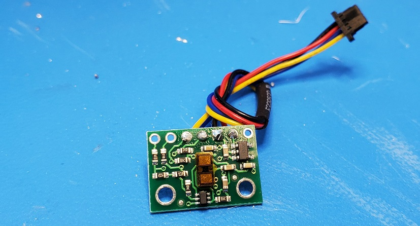
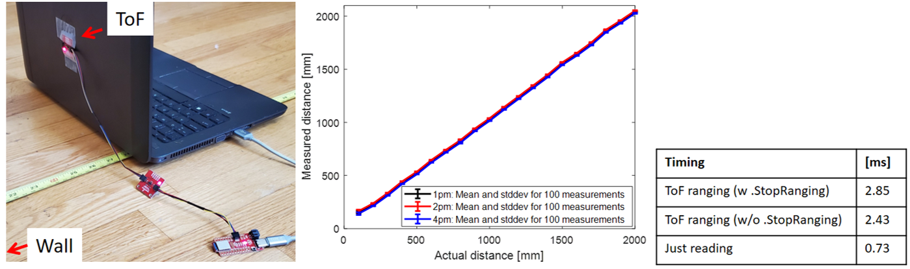

# Fast Robots @Cornell, Spring 2023

[Return to main page](index.md)

# Lab 3 Time of Flight Sensors

## Objective
The purpose of this lab is to equip the robot with sensors - the faster the robot can sample and the more it can trust a sensor reading, the faster it is able to drive. 

## Parts Required
* 1 x [SparkFun RedBoard Artemis Nano](https://www.sparkfun.com/products/15443)
* 1 x [USB cable](https://www.amazon.com/SUMPK-Charging-Braided-Compatible-Samsung/dp/B08R68T84N/ref=sr_1_4?keywords=usb+c+to+c&qid=1636380583&qsid=147-6677549-1776715&refinements=p_n_feature_ten_browse-bin%3A23555327011&rnid=23555276011&s=pc&sr=1-4&sres=B08D9SB161%2CB08R68T84N%2CB01CZVEUIE%2CB01FM51812%2CB07VCZV3R4%2CB075V68NVR%2CB075GMKZWW%2CB093BVBRJT%2CB09BBBJ33F%2CB09C2D9Z7T%2CB012V56D2A%2CB092CYFQMP%2CB081L4V3DN%2CB07Y6ZJT1D%2CB07Y2XKPX5%2CB07VPYJV8V%2CB07THJGZ9Z%2CB08W2TP2TT%2CB0744BKDRD%2CB07THFJ1J5&srpt=ELECTRONIC_CABLE)
* 2 x [4m ToF sensor](https://www.pololu.com/product/3415)
* 1 x [QWIIC Breakout board](https://www.sparkfun.com/products/18012) 
* 2 x [Qwiic connector](https://www.sparkfun.com/products/14426)
* 1 x Ruler or graph paper

### Prelab

In this lab, we will setup a Time-of-Flight (ToF) sensor, which is based on the VL53L1X. Please skim the [manual](https://cdn.sparkfun.com/assets/e/1/8/4/e/VL53L1X_API.pdf), and check out the [datasheet](https://cdn.sparkfun.com/assets/8/9/9/a/6/VL53L0X_DS.pdf) before beginning this lab. Note the sensor I2C address.

Eventually, we will use two ToF sensors. The address of the sensor is hardwired on the board which means you cannot (as is) address the two sensors individually. You can change the address programmatically (while powered) or you can enable the two sensors separately through their shutdown pins. Decide and argue for which approach you want to use (and how you will do this). Given their range and angular sensitivity, think about where you will place them on your robot to best detect obstacles in future labs. Discuss scenarios where your robot will miss obstacles. 

To help you get through the lab, consider installing [SerialPlot](https://hackaday.io/project/5334-serialplot-realtime-plotting-software) to help visualize your data.

***Think ahead!***

While you can choose to ignore the robot in this lab, you will have to permanently cut wires, and so it is worth doing so with their position in the robot in mind, such that you won't have to redo too much later on. Discuss your thinking in the write-up. Sketch out a diagram of all the wires you will need to connect:
* Think about which connections you want to be detachable and which can be permanent
* Think about which side of the sensors you mount the wires from.
* Think about the placement of each sensor in the chassis and how long the wires have to be.

## Instructions

1. Using the Arduino library manager, install the SparkFun VL53L1X 4m laser distance sensor library.
2. Connect the QWIIC break-out board to the Artemis
3. Connect the first ToF sensor to the QWIIC breakout board.
   - You will have to cut one end of a QWIIC cable and solder the other to your sensor. You have two long cables and two short ones, choose wisely. 
   - Think about which color attaches to SDA/SCL?
   - The photo below is an example of a sensor with a cable. Note that the protective film has not yet been removed.
   

4. Scan the I2C channel to find the sensor
   - Go to File->Examples->Apollo3->Wire and open Example1_wire_I2C
   - Browse through the code to see how to use i2c commands. 
   - Run the code. Does the address match what you expected? If not, explain why.
5. The ToF sensor has three modes, that optimize the ranging performance given the maximum expected range. Discuss the pros/cons of each mode, and think about which one could work on the final robot.
   <code><pre>
   .setDistanceModeShort();  //1.3m
   .setDistanceModeMedium(); //3m
   .setDistanceModeLong();   //4m, Default
   </code></pre>

6. Test your chosen mode 
   - Use the "..\Arduino\libraries\SparkFun_VL53L1X_4m_Laser_Distance_Sensor\examples\Example1_ReadDistance" example
   - Document your ToF sensor range, accuracy, repeatability, and ranging time
   - The figure below is an example from 2020, when students measured the accuracy and repeatability in different lighting conditions, and timing for various code setups (these are not all required tasks for this year), however, we highly recommend generating your plots in the Jupyter notebook to gain more familiarity with the environment, e.g. using [matplotlib](https://matplotlib.org/).    
   

7. Using notes from the pre-lab, hook up both ToF sensors simultaneously and demonstrate that both works. 
   - Fyi, don't use the Example1_wire code to do this, it works poorly when multiple sensors are attached.  

8. In future labs, it is essential that the code executes quickly, therefore you cannot let your code hang while it waits for the sensor to finish a measurement. Write a piece of code that prints the Artemis clock to the Serial as fast as possible, continuously, and prints new ToF sensor data from both sensors only when available.
   - Fyi, the distanceSensor.checkForDataReady() routine can be called to check when new data is available.
   - How fast does your loop execute, and what is the current limiting factor?

9. Finally, edit your work from Lab 2, such that you can record time-stamped ToF data for a set period of time, and then send it over Bluetooth to your computer.
   - It will be helpful in future labs, if you also write a function in Jupyter to plot the data on a graph with time (us or ms for example) on the x-axis and ToF data on the y-axis. 

### Additional tasks for 5000-level students:

1. Many distance sensors are based on infrared trasmission. 
   - Discuss a couple, highlight the differences in their fuctionality and the pros/cons of each. 
   - Check and discuss whether the ToF sensor is sensitive to different colors and textures. 

---

## Write-up

Word limit: < 1000 words

This is not a strict requirement, but may be helpful in understanding what should be included in your webpage. It also helps with the flow of your report to show your understanding to the lab graders.

1. Prelab
   * Note the I2C sensor address
   * **Briefly** discuss the approach to using 2 ToF sensors
   * **Briefly** discuss placement of sensors on robot and scenarios where you will miss obstacles
   * Sketch of wiring diagram (with **brief** explanation if you want)
2. Lab Tasks
  * Picture of your ToF sensor connected to your QWIIC breakout board
  * Screenshot of Artemis scanning for I2C device (and discussion on I2C address)
  * Discussion and pictures of sensor data with chosen mode
  * 2 ToF sensors: Discussion and screenshot of sensors working in parallel
  * Tof sensor speed: Discussion on speed and limiting factor; include code snippet of how you do this
  * Time v Distance: Include graph of data sent over bluetooth (2 sensors)
  * (5000) Discussion on infrared transmission based sensors
  * (5000) Sensitivity of sensors to colors and textures

Please also include code snippets (consider using GitHub Gists) in appropriate sections if you included any written code. Do not copy and paste all your code. Include only relevant functions used for each task.

Include screenshots of relevant results (i.e. messages received in Jupyter Notebook, serial terminal print of messages received by Artemis).
