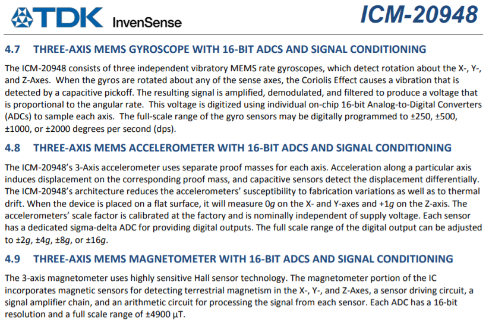
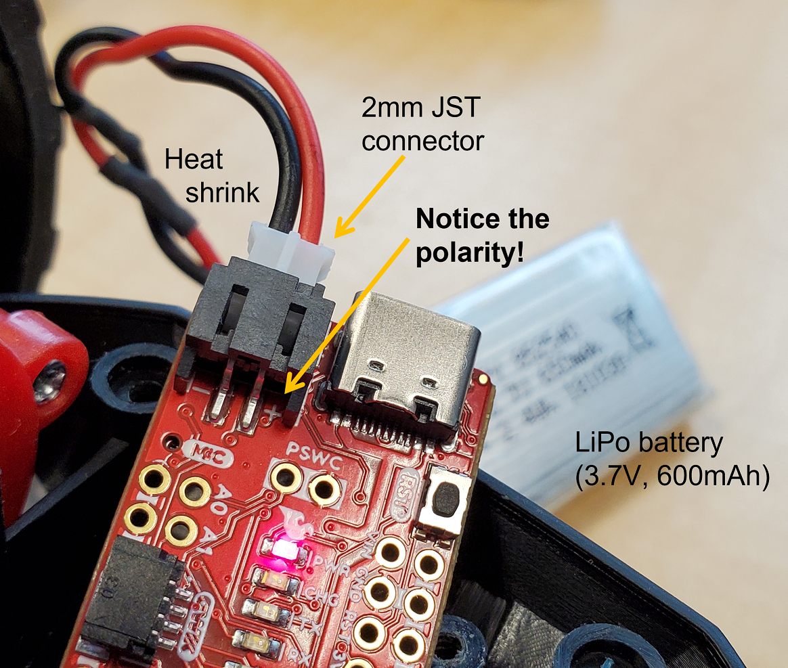

# Fast Robots @Cornell, Spring 2023

[Return to main page](index.md)

# Lab 4: IMU

## Objective
The purpose of this lab is to add the IMU to your robot, start running the Artemis+sensors from a battery, and record a stunt on your RC robot. 

## Parts Required
* 1 x [SparkFun RedBoard Artemis Nano](https://www.sparkfun.com/products/15443)
* 1 x [USB cable](https://www.amazon.com/SUMPK-Charging-Braided-Compatible-Samsung/dp/B08R68T84N/ref=sr_1_4?keywords=usb+c+to+c&qid=1636380583&qsid=147-6677549-1776715&refinements=p_n_feature_ten_browse-bin%3A23555327011&rnid=23555276011&s=pc&sr=1-4&sres=B08D9SB161%2CB08R68T84N%2CB01CZVEUIE%2CB01FM51812%2CB07VCZV3R4%2CB075V68NVR%2CB075GMKZWW%2CB093BVBRJT%2CB09BBBJ33F%2CB09C2D9Z7T%2CB012V56D2A%2CB092CYFQMP%2CB081L4V3DN%2CB07Y6ZJT1D%2CB07Y2XKPX5%2CB07VPYJV8V%2CB07THJGZ9Z%2CB08W2TP2TT%2CB0744BKDRD%2CB07THFJ1J5&srpt=ELECTRONIC_CABLE)
* 1 x [9DOF IMU sensor](https://www.mouser.com/ProductDetail/SparkFun/SEN-15335?qs=uwxL4vQweFMcls1MYZT00A%3D%3D)
* 2 x [4m ToF sensor](https://www.pololu.com/product/3415)
* 1 x [QWIIC Breakout board](https://www.sparkfun.com/products/18012) 
* 2 x [Qwiic connector](https://www.sparkfun.com/products/14426)
* 1 x [JST2 connector+cable](https://www.amazon.com/dp/B07V56N33J?smid=A2ZDGCOOU4F0SF&ref_=chk_typ_imgToDp&th=1)
* 1 x [Force1 RC car](https://force1rc.com/products/cyclone-remote-control-car-for-kids-adults)
* 1 x [Li-Ion 3.7V 850mAh battery](https://www.amazon.com/URGENEX-Battery-Rechargeable-Quadcopter-Charger/dp/B08T9FB56F/ref=sr_1_3?keywords=lipo+battery+3.7V+850mah&qid=1639066404&sr=8-3))

### Prelab

Please read up on the IMU. This year, we're using the [Sparkfun](https://www.sparkfun.com/products/15335) breakout board, their information gives a nice quick overview of the functionality, and their [software library](https://github.com/sparkfun/SparkFun_ICM-20948_ArduinoLibrary) works well. The ICM-20948 datasheet can be found [here](https://cdn.sparkfun.com/assets/7/f/e/c/d/DS-000189-ICM-20948-v1.3.pdf). 

Finally, please skim the lab instructions so you are ready to hit the road when your section starts. This lab is extensive, so be prepared to put in the hours.

### Instructions

### Prep the RC car

1. Start charging the battery for the RC car, using the USB charger that comes with it. 
 
#### Setup the IMU

1. Using the Arduino library manager, install the SparkFun 9DOF IMU Breakout - ICM 20948 - Arduino Library.
2. Connect the IMU to the Artemis board using the QWIIC connectors/cable.
3. Run the "..\Arduino\libraries\SparkFun_ICM-20948\SparkFun_ICM-20948_ArduinoLibrary-master\examples\Arduino\Example1_Basics". 
   - Note the AD0_VAL definition. What does it represent, and should it be 0 or 1?
   - Check out the change in sensor values as you rotate, flip, and accelerate the board. Explain what you see in both acceleration and gyroscope data.
4. Add a visual indication that the board is running - for example, blink the LED three times slowly on start-up. This will be handy later in the lab.

#### Accelerometer

1. Use the equations from class to convert accelerometer data into pitch and roll. To use atan2 and M_PI, you have to include the math.h library. 
   - Show the output at {-90, 0, 90} degrees pitch and roll. Hint: You can use the surface and edges of your table as guides to ensure 90 degree tilt/roll.  
   - How accurate is your accelerometer? You may want to do a two-point calibration (i.e. measure the output at either end of the range, and calculate the conversion factor such that the final output matches the expected output). 
2. The accelerometer is noisy, especially when you run the RC car in its proximity. Record some of this data, and analyze the noise in the frequency spectrum. 
   - Here's a helpful tutorial to do a [Fourier Transform in Python](https://alphabold.com/fourier-transform-in-python-vibration-analysis/)
   - Use this analysis to guide your choice of a complimentary low pass filter cut off frequency (recall implementation details from the [lecture](./lectures/FastRobots-4-IMU.pdf). Discuss how the choice of cut off frequency affects the output.
   - If there's little noise, check out the information on the chip and reason about why that might be. (Note, this may differ between kits)
   
#### Gyroscope

1. Use the equations from class to compute pitch, roll, and yaw angles from the gyroscope. 
   - Compare your output to the pitch and roll values from the accelerometer and the filtered response. Describe how they differ.
   - Try adjusting the sampling frequency to see how it changes the accuracy of your estimated angles.
2. Use a complimentary filter to compute an estimate of pitch and roll which is both accurate and stable. Demonstrate its working range and accuracy, and that it is not susceptible to drift or quick vibrations.

#### Sample Data

1. Speed up execution of the main loop
   - Similar to Lab 3, make sure you don't wait for IMU data to be ready - instead just check if data is ready in every iteration of the main loop. If ready - store it in your array. 
   - Remove any delays you've inserted for debugging
   - Serial.print statements are a significant source of delays, be sure to comment all of these out 
   - How quickly are you able to sample new values?

2. Similar to Lab 2/3, collect and store time-stamped IMU data in arrays

3. Integrate your code from Lab 3, such that the Artemis captures both ToF data and IMU data
   - Consider if it makes sense to have one big array, or separate arrays for storing ToF, Accelerometer, and Gyroscope data, argue for your choice
   - Consider the memory of the Artemis; how much memory can you allocate to your arrays? What does that correspond to in seconds?

4. Demonstrate that your board can capture at least 5s worth of ToF data and IMU data and send it over Bluetooth to the computer.
  
#### Cut the Coord!

5. Unplug the USB C cable from the Artemis, and connect a battery instead. You have two batteries available. One is 3.7V 850mAh, you will use this one to power the motors through the motor drivers. The other is 3.7V 650mAh and comes with the RC car, you will use this one to power the digital electronics (Artemis, sensors, etc.).
   - Consider why we are asking you to use the battery with more capacity to drive the motors. 
   - Solder the cables from 650mAh battery to the JST connector as shown in the image below. *Do not short the wires!! Prepare one wire first, apply heat shrink tubing, solder the wire to the JST connector, heat the shrink tubing. Then proceed to cut the next wire and repeat the steps.*
   - Triple check that the JST connector is oriented correctly. Does the red wire connect to the "+" on the board?
   - Connect the power and ensure that the board still runs. Do you still receive Bluetooth data? If not, do you still see the visual indication/LED blinking you set up above? (This should help you debug where potential errors are located)

#### Record a stunt!

7. Mount the 850mAh battery in the RC car. Note that the standard plug on the 850mAh battery can be attached in either orientation, so *be careful* to plug it in in the right orientation (red-to-red and black-to-black wire). Add AA batteries to the remote control.
8. Spend 5min playing around with the car (in the hallway or outside). Try to get a feel for how slow/fast it can drive forwards/backwards/turn, accelerations, etc. Record a video to show what you have tried, and discuss what you observe. This will help you establish a baseline for what you expect to see if everything works when you are running the car autonomously. 
9. Finally, using tape/zip ties, mount the Artemis with battery and sensors onto the car, and try to record a stunt of your choosing (e.g. drive straight and do a couple of turns, do a flip, etc.). To demonstrate that your system works, please include both a video and a graph showing the data you collected during the stunt in your write-up. 
   - If you run out of time during your lab/open lab hours, note that the laminate floor in most of Phillips Hall will work just as well for this task as the floor in PH427.

#### Pack up

9. Don't forget to disconnect your batteries from both the Artemis and the robot.
   - From this point onwards, always show up to the lab section with charged batteries. You can charge the 650mAh battery through USB using the Artemis board's built-in charger, and the 850mAh battery in one of the many chargers in the lab.
   - You can take one of the 850mAh batteries home with you. Please leave the rest in the lab for everyone to share.
   - *If you have used one of the shared 850mAh batteries, please plug it into the lab chargers before you leave!* 
10. If you're done playing with your RC car, please also take out the AA batteries from the remote control and hand them back to the TAs so we can use them for following labs. Starting lab 5, we will no longer use the remote control.

#### Additional Tasks for 5000-level students

You're off the hook in this lab!

---

## Write-up

To demonstrate that you've successfully completed the lab, please upload a brief lab report (<1.000 words), with code snippets (not included in the word count), photos, and/or videos documenting that everything worked and what you did to make it happen. 
