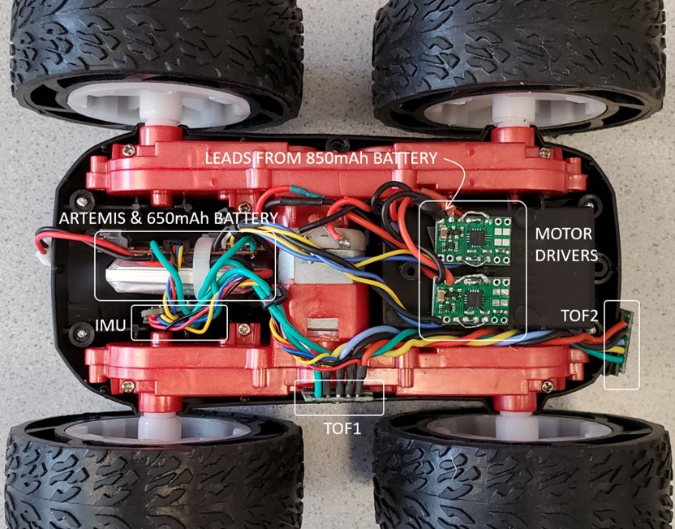

# Fast Robots @Cornell, Spring 2023

[Return to main page](index.md)

# Lab 5: Motors and Open Loop Control

## Objective

The purpose of this lab is for you to change from manual to open loop control of the car. At the end of this lab, your car should be able to execute a pre-programmed series of moves, using the Artemis board and two dual motor drivers. 

## Parts Required

* 1 x [SparkFun RedBoard Artemis Nano](https://www.sparkfun.com/products/15443)
* 1 x [USB cable](https://www.amazon.com/SUMPK-Charging-Braided-Compatible-Samsung/dp/B08R68T84N/ref=sr_1_4?keywords=usb+c+to+c&qid=1636380583&qsid=147-6677549-1776715&refinements=p_n_feature_ten_browse-bin%3A23555327011&rnid=23555276011&s=pc&sr=1-4&sres=B08D9SB161%2CB08R68T84N%2CB01CZVEUIE%2CB01FM51812%2CB07VCZV3R4%2CB075V68NVR%2CB075GMKZWW%2CB093BVBRJT%2CB09BBBJ33F%2CB09C2D9Z7T%2CB012V56D2A%2CB092CYFQMP%2CB081L4V3DN%2CB07Y6ZJT1D%2CB07Y2XKPX5%2CB07VPYJV8V%2CB07THJGZ9Z%2CB08W2TP2TT%2CB0744BKDRD%2CB07THFJ1J5&srpt=ELECTRONIC_CABLE)
* 1 x [9DOF IMU sensor](https://www.mouser.com/ProductDetail/SparkFun/SEN-15335?qs=uwxL4vQweFMcls1MYZT00A%3D%3D)
* 2 x [4m ToF sensor](https://www.pololu.com/product/3415)
* 1 x [QWIIC Breakout board](https://www.sparkfun.com/products/18012) 
* 2 x [Qwiic connector](https://www.sparkfun.com/products/14426)
* 1 x [JST2 connector+cable](https://www.amazon.com/dp/B07V56N33J?smid=A2ZDGCOOU4F0SF&ref_=chk_typ_imgToDp&th=1)
* 1 x [Force1 RC car](https://force1rc.com/products/cyclone-remote-control-car-for-kids-adults)
* 1 x [Li-Ion 3.7V 850mAh battery](https://www.amazon.com/URGENEX-Battery-Rechargeable-Quadcopter-Charger/dp/B08T9FB56F/ref=sr_1_3?keywords=lipo+battery+3.7V+850mah&qid=1639066404&sr=8-3)
* 2 x [Dual motor drivers](https://www.digikey.com/en/products/detail/pololu-corporation/2130/10450426)

## Prelab

Check out the [documentation](https://www.pololu.com/product-info-merged/2130) and the [datasheet](https://www.ti.com/general/docs/suppproductinfo.tsp?distId=10&gotoUrl=https%3A%2F%2Fwww.ti.com%2Flit%2Fgpn%2Fdrv8833) for the dual motor driver. 

Note that to deliver enough current for our robot to be fast, we will parallel-couple the two inputs and outputs on each dual motor driver, essentially using two channels to drive each motor. This means that we can deliver twice the average current without overheating the chip. While it is a bad idea to parallel couple motor drivers from separate ICs because their timing might differ slightly, you can often do it when both motor drivers exist on the same chip with the same clock circuitry.  
In your lab write-up, discuss/show how you decide to hook up/place the motor drivers. 
* What pins will you use for control on the Artemis? (It is worth considering both [pin functionality](https://cdn.sparkfun.com/assets/5/5/1/6/3/RedBoard-Artemis-Nano.pdf) and physical placement on the board/car).
* We ask you to power the Artemis and the motor drivers/motors from separate batteries. Why is that? 
* Consider routing paths given EMI, wire lengths, and color coding. Long wires may not fit in the chassis, and lead to unnecessary noise. Wires that are too short, will make repair harder. Using solid-core wire can cause problems when the car undergoes high accelerations. 
* As always, skim all the instructions for the lab before you show up to your section!

## Instructions

1. Connect the necessary power and signal inputs to one dual motor driver (where inputs/outputs are hooked up in parallel as discussed in lecture) from the Artemis. 
   - For now, keep the motor driver (VIN) powered from an external power supply with a controllable current limit; this will make debugging easier. 
   - What are reasonable settings for the power supply? 
   
4. Use analogWrite commands to generate PWM signals and show (using an oscilloscope) that you can regulate the power on the motor driver output. 

5. Take your car apart!
   - Unscrew and remove the top (blue) shell from your car. You may have to cut the wires for the chassis LEDs (we will not be using them in this class). *Don't loose the screws!!*
   - Locate and unmount the control PCB and cut wires to the motors and the battery connector as close to the board as possible.

6. Place your car on its side, such that the spinning wheels are elevated, and show that you can run the motor in both directions. 
   - Keep the motor driver powered on an external power supply for now, but remember to connect all grounds in your circuit. 

7. Power the motor driver from the 850mAh battery instead of the power supply (double check color codes before you plug it in), and make sure your code works when the circuit is fully battery powered. 

8. Repeat the process for the second motor and motor driver. One 850mAh battery should be enough to power both motors. 

9. Install everything inside your car chassis, and try running the car on the ground. 
   - Remember, the car may flip, so try to avoid having components that stick out beyond the wheels.
   - Also, the car is very fast, so test it in the hallway and add a timer in code so that it stops automatically after a short amount of time. That way you don't have to try to catch it when it gets away from you!
   - Here is an example of a car with everything hooked up (note that we did not use QWIIC connectors in this one). Remember that the implementation details are entirely up to you. (See image below step 12)

10. Explore the lower limit in PWM value for which the robot moves forward and on-axis turns while on the ground; note it may require slightly more power to start from rest compared to when it is running. 

12. If your motors do not spin at the same rate, you will need to implement a calibration factor. To demonstrate that your robot can move in a fairly straight line, record a video of your robot following a straight line (e.g. a piece of tape) for at least 2m/6ft. 
   - It may be helpful to note that each of the vinyl tiles in the lab is 1-by-1 foot. 
   - The robot should start centered on the line, and still partially overlap with the line at the end. 

12. Demonstrate open loop, untethered control of your robot - add in some turns. 

## Additional tasks for 5000-level students

1. Consider what frequency analogWrite generates. Is this adequately fast for these motors? Can you think of any benefits to manually configuring the timers to generate a faster PWM signal?

2. Relating to task 10 above, try to (experimentally) figure out not just at what PWM value the robot starts moving (forward and on-axis turns), but also the lowest PWM value at which you can keep the robot running once it is in motion. How quickly can you have the robot settle at its slowest speed? (First program a value that overcomes static friction and gets the robot moving, then a value that keeps it moving as slowly as possible.)

## Write-up
To demonstrate that you've successfully completed the lab, please upload a brief lab report (<800 words), with code snippets (not included in the word count), photos, and videos documenting that everything work and what you did to make it happen. 

