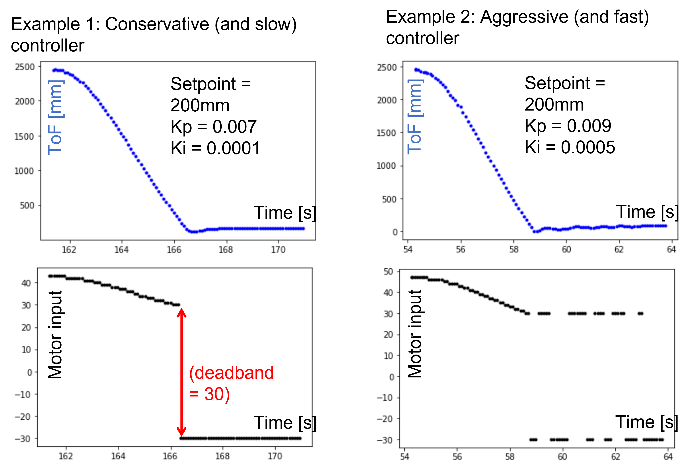
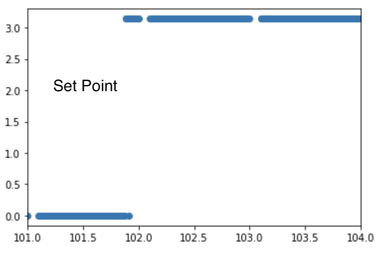
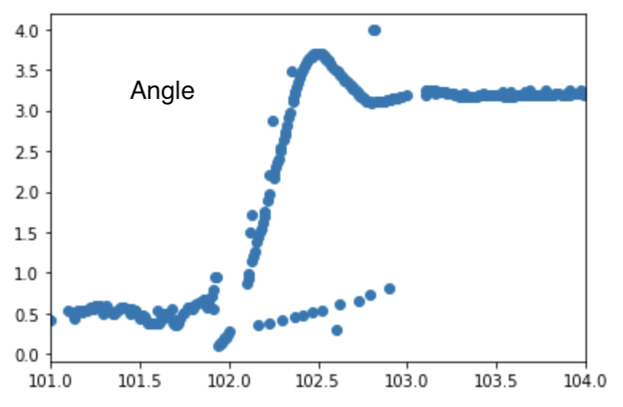
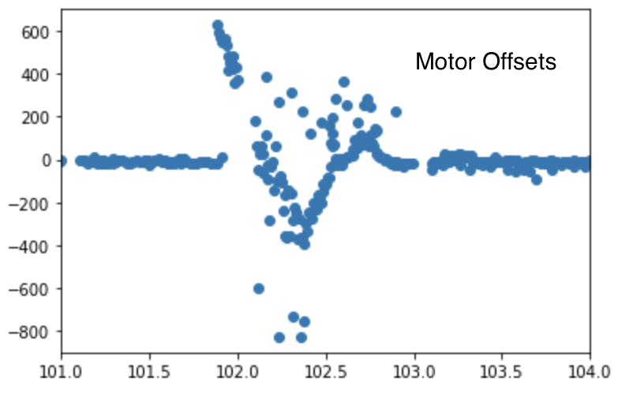

# Fast Robots @Cornell, Spring 2023

[Return to main page](index.md)

# Lab 6: Closed-loop control (PID)

## Objective
The purpose of this lab is to get experience with PID control. The lab is fairly open ended, you can pick whatever controller works best for your system (P, PI, PID, PD). Your hand-in will be judged upon your demonstrated understanding of PID control and practical implementation constraints, and the quality of your solution. 

This lab is part of a series of labs (6-8) on PID control, sensor fusion, and stunts. 
This week you can choose to do either position control or orientation control. The former is easier and a good choice if you a very strained for time. The latter is a little harder, but will be of direct use in future labs (it is also more fun!). Whatever you choose, spend this week getting the basic behavior working. While we give you tips for improving/speeding up your controller in this lab, if you run out of time, you can optimize more over the coming weeks. 

## Parts Required
* 1 x [R/C stunt car](https://force1rc.com/products/cyclone-remote-control-car-for-kids-adults)
* 1 x [SparkFun RedBoard Artemis Nano](https://www.sparkfun.com/products/15443)
* 1 x [USB cable](https://www.amazon.com/SUMPK-Charging-Braided-Compatible-Samsung/dp/B08R68T84N/ref=sr_1_4?keywords=usb+c+to+c&qid=1636380583&qsid=147-6677549-1776715&refinements=p_n_feature_ten_browse-bin%3A23555327011&rnid=23555276011&s=pc&sr=1-4&sres=B08D9SB161%2CB08R68T84N%2CB01CZVEUIE%2CB01FM51812%2CB07VCZV3R4%2CB075V68NVR%2CB075GMKZWW%2CB093BVBRJT%2CB09BBBJ33F%2CB09C2D9Z7T%2CB012V56D2A%2CB092CYFQMP%2CB081L4V3DN%2CB07Y6ZJT1D%2CB07Y2XKPX5%2CB07VPYJV8V%2CB07THJGZ9Z%2CB08W2TP2TT%2CB0744BKDRD%2CB07THFJ1J5&srpt=ELECTRONIC_CABLE)
* 2 x [Li-Po 3.7V 650mAh (or more) battery](https://www.amazon.com/URGENEX-Battery-Rechargeable-Quadcopter-Charger/dp/B08T9FB56F/ref=sr_1_3?keywords=lipo+battery+3.7V+850mah&qid=1639066404&sr=8-3)
* 2 x [Dual motor driver](https://www.digikey.com/en/products/detail/pololu-corporation/2130/10450426)
* 2 x [4m ToF sensor](https://www.pololu.com/product/3415)
* 1 x [9DOF IMU sensor](https://www.digikey.com/en/products/detail/pimoroni-ltd/PIM448/10246391)
* 1 x [Qwiic connector](https://www.sparkfun.com/products/14426)

## Prelab / BLE 

No matter which task you take on, it will be essential that you first setup a good system for _debugging_. 

**Please attempt to implement this before your lab session. Feel free to discuss the best strategy with your team mate.**

A good technique will be to: 
1. Have the robot controller start on an input from your computer sent over Bluetooth
2. Execute PID control over a fixed amount of time (e.g. 5s) while storing debugging data in arrays.
3. Remember to have a hard stop implemented directly on your Artemis, so that your robot will stop even if the Bluetooth connection fails.
4. Upon completion of the behavior, send the debugging data back to the computer over Bluetooth. 

Debugging data may for example include sensor data with time stamps similar to what you implemented in lab 3-4, output from the individual branches of your PID controller, and/or the input that you are sending to your motors. Remember, however, the storage cannot exceed the internal RAM of 384kB.  If you plan to do a lot of tweaking of your gains, you can also consider writing a Bluetooth command that lets you update the gains without having to reprogram the Artemis. 

## Lab Procedure

Choose one of the following two tasks. The objective will be to achieve reliable and accurate, yet fast control. Note that the task you choose in this lab will eventually create the basis of the stunt you can attempt in Lab 8. 

**Tips and tricks:**
   - _LOG DATA:_ If you don't want to repeat work during Lab 7, be sure to log all data (time stamped sensor values and motor outputs), as well as setup variables from at least one successful run.
   - _Lectures:_ Brush up on your PID control skills by checking out [Lectures 7 and 8](https://cei-lab.github.io/ECE4960-2022/lectures/).
   - _PID library:_ There exists an [Arduino PID library](https://playground.arduino.cc/Code/PIDLibrary/). You are welcome to use this library if you prefer, but we will only offer limited TA support if you run into issues. Implementing a basic PID controller from scratch is easy (<10 lines of code), and will give you more freedom in dealing with noise, wind-up, and system non-linearities. 
   - _Start simple:_ E.g. with a proportional controller running at low speeds and a generous setpoint, then you can work your way up to faster speeds, more advanced control, and more difficult setpoints if you have time. 
   - _Documentation:_ Please clearly document the maximum linear or angular speed you are able to achieve (you can use your sensors to compute this). To demonstrate reliability, please upload videos of at least three repeated (and hopefully successfull) experiments.  
   - _Frequency:_ Fast loop times means everything to a good controller. Be sure to include a discussion of sensor sampling rate and how this affects the timing of your control loop. Avoid using blocking statements when you can (e.g. `delay()` or `while(sensor not ready) ){wait}` ). Also, remember that any serial.print/BLE sending that occurs during execution may slow down your loop time considerably. 
   - _Deadband:_ From Lab 5, you should have found the deadband of your motor (the region below which the power to the motors does not overcome the static friction in your system). Consider writing a scaling function that converts the output from your PID controller to an output for which the motors can actually react. 
   - _Wind up:_ If you include an integrator, consider whether you need to worry about integrator wind-up. 
   - _Derivative LPF:_ If you include a derivative, consider whether it is necessary to include a low pass filter in the derivative branch. 
   - _Derivative kick:_ Consider whether the derivative kick can cause any issues, given the task you choose. Here is a great overview on how to eliminate derivative kick: http://brettbeauregard.com/blog/2011/04/improving-the-beginner’s-pid-derivative-kick/
   - _Anything goes:_ The goal is a working system. When you have a reasonable control setup working, you should feel free to add any "hacks" that will improve your robot performance in a reliable way. If you don't have time to implement them, discussing what you imagine would help can still get you grading points. 
   - _Motor drivers:_ Recall [Lecture 6 on Actuators](https://cei-lab.github.io/ECE4960-2022/lectures/FastRobots-6-Actuators.pdf) and that the motor drivers have both coasting and active breaking modes. These might come in handy.

### Task A: Don't Hit the Wall!!

Again, if you are very low on time this week, this task is a good choice. 

For this task, you will have your robot drive as fast as possible (given the quality of your controller) towards a wall, then stop when it is exactly 1ft (=304mm=1 floor tile in the lab) away from the wall using feedback from the time of flight sensor. Your solution should be robust to changing conditions, such as the starting distance from the wall (2-4m). If you attempt to do this at home, you could also show that your solution is robust to changing floor surface, e.g. linoleum or carpet. The catch is that any overshoot or processing delay may lead to crashing into the wall.

Beyond the considerations mentioned above, think about the following:
   - Given the range of motor input values and the output from your tof sensor, discuss what a reasonable range of the proportional controller gain will be. 
   - Consider the range and sampling time you choose for your TOF sensor; it may be worth lowering the accuracy for faster updates. Note that the medium range is only available if you are using the ([ToF Pololu library](https://github.com/pololu/vl53l0x-arduino)). 
   - Also note that the sensor has a programmable integration time. If this is set too high, you will see large jumps in your data as the robot drives and you can no longer assume that the measurements are independent. You can lower the integration time (trading off accuracy for speed) using: `proximitySensor.setProxIntegrationTime(4); //A value of 1 to 8 is valid`. Again this function is only available in the [Tof Pololu library](https://github.com/pololu/vl53l0x-arduino).

Below you can see an example of a simple PI controller acting on the TOF signal.

Corresponding videos are here: 

      .

> **<mark> NOTE: If you choose this task, your eventual stunt will involve speeding towards the 1ft position (where a small sticky matt will be located), then doing a vertical flip and driving back in the direction from where you came. In this lab you will be limited by sensor sampling rate and you may have to lower the motor speed accordingly. In Lab 7 we will look at sensor fusion as a way to overcome this problem.

### Task B: Drift much?

To lower your overall class workload, this task is a good choice.
   
For this task, you will have the robot drive fast forward, then turn with drift to do a 180 degree turn, and return in the direction it came from without stopping. The PID controller should be controlling the orientation of your robot by introducing a difference in motor speeds. Before trying to get your car to drift, try controlling the orientation of your car while it is stationary, then introduce a base speed. 

Beyond the considerations mentioned above, think about the following:
  - How do you get the orientation of the robot? How can you minimize the error introduced by discrete integration of the gyroscope? 
  - How fast is your robot turning? You may have to check whether you are maxing out the gyroscope. The library will allow you to adjust the range. 
  - The PID controller should control an “offset” or differential in wheel speed. That way you can control the orientation even if the car is moving at a set base speed.

Below you can see an example of the controller maintaining a constant orientation even when the robot is kicked. 

Below is an example of the robot drifting and doing a 180 degree turn as well as graphs of the setpoint, angle, and control signal for the PID controller. 

   > **<mark> NOTE: If you choose this task, your eventual stunt will involve speeding towards a wall until you are 3ft (914mm = 3 floor tiles in the lab) out, then turning 180 degrees and driving back from where you came (as fast as possible). Just like in Task A, lab 7 will involve sensor fusion on the time of flight sensor to help you estimate the distance to the wall at a high sampling rate. 

## Write-up

To demonstrate that you've successfully completed the lab, please upload a brief lab report (<800 words), with code snippets (not included in the word count), graphs of sampled data, videos and/or photos documenting that everything worked reliably and what you did to make it happen. 
