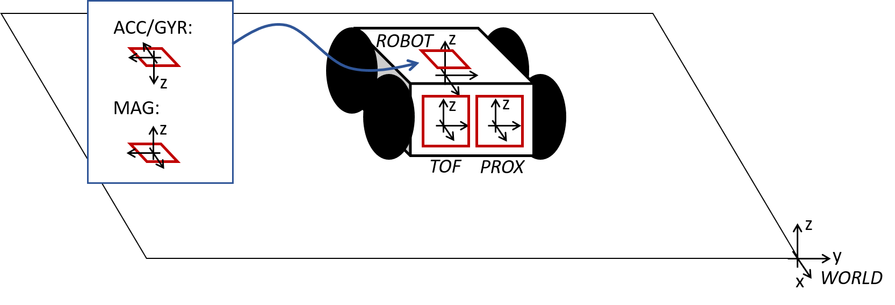

# Fast Robots @Cornell, Spring 2023

[Return to main page](index.md)

# Lab 9: Mapping

## Objective

The purpose of this lab is to map out a static room (in this case the front room of the lab); you will use this map in later localization and navigation tasks. To build the map, you will place your robot in a couple of marked up locations around the lab, and have it spin around its axis while collecting ToF readings.  

The quality of your map will depend on how many readings you manage to obtain during a rotation and how consistently they are separated in angular space.  You can solve this lab either through 1) open loop control, 2) PID control on orientation (i.e. integrated gyroscope values), or 3) PID control on angular speed (i.e. the raw gyroscope values). When you have all the readings, you will merge them together using transformation matrices, plot them, and then use these to draw up the map using straight line segments. 

## Parts Required

* 1 x Fully assembled [robot](https://www.amazon.com/gp/product/B07VBFQP44/ref=ppx_yo_dt_b_asin_title_o00_s00?ie=UTF8&psc=1), with [Artemis](https://www.sparkfun.com/products/15443), [TOF sensors](https://www.pololu.com/product/3415), and an [IMU](https://www.digikey.com/en/products/detail/pimoroni-ltd/PIM448/10246391).

## Prelab

Consider checking out [lecture 2 on transformation matrices](./lectures/FastRobots-2-TransformationMatrices.pdf) again.

### Control

You can complete your control in either one of the following ways:

1. _Open loop control:_ If you are very short on time this week, you can use open loop control. You can either program your robot to spin around its own axis as slowly as possible while recording ToF readings, or you can program it to rotate in small increments interspersed with brief stops to record ToF readings. Recall that the ToF sensor will report false outputs if the distance to the object changes too drastically during a reading -- a stationary robot can guarantee that the ToF sensor is pointing towards a fixed point in space. 
   - This is by far the easiest type of control and if you are very pressed for time this is a good option. 
   - Note that the angular spacing between your readings will likely be very inaccurate and depend on floor friction, battery levels, etc. This may lead to a poor map and it may lead to poor performance during the localization and navigation labs later in the semester.
   - Please quantify and/or use graphs to document that your open loop control works, and upload a video that shows how your robot turns. 
   - You can maximally score 5 points in this lab if you decide to do open loop control. 

2. _Orientation control:_ If you choose this option, create a PID controller that allows your robot to do on-axis turns in small, accurate increments. 
   - Aim for at least 14 readings (roughly 25 degree increments) per 360 degree rotation. 
   - If you completed Task B Orientation Control in [lab 6](Lab6.md) this is likely the easiest solution. 
   - This option may also be best if you cannot get your robot to do slow reliable turns. Recall that the ToF sensor will report false outputs if the distance to the object changes too drastically during a reading -- a stationary robot can guarantee that the ToF sensor is pointing towards a fixed point in space.
   - Please quantify and/or use graphs to document that your PID controller works well, and upload a video that shows if your robot turns (roughly) on axis. 
   - Given the drift in your sensor, the size and accuracy of your increments, and how reliably your robot turns on axis, reason about the average and maximum error of your map if you were to do an on-axis turn in the middle of a 4x4m square, empty room. 
   - If you choose this option, you can score up to 7.5 points in this lab.

3. _Angular speed control:_ If you choose this option, create a PID controller that works directly on the raw gyroscope values. This is beneficial over orientation control, because you avoid accumulating errors during integration. 
   - Try to aim for a maximum of 25 degrees per second, as this will allow you to do 14 sensor readings spaced out by approximately 1s. (This may be too hard given your particular robot; a higher angular speed is fine, as long as your map comes out reasonable). 
   - You will likely need to low pass filter the gyroscope values - read up on how we did that with a complementary LPF in [Lecture 4, slide 23](/lectures/FastRobots-4-IMU.pdf). 
   - You can also consider adjusting the integration time of the TOF sensor, using `proximitySensor.setProxIntegrationTime(4); //A value of 1 to 8 is valid`. Note that this function is only available in the [Tof Pololu library](https://github.com/pololu/vl53l0x-arduino).  
   - One way to make the robot spin even slower is to block one set of wheels while turning the others. This means that your robot is now driving in a slight circle (rather than on-axis), which will make post-processing of data slightly more difficult, but allow you to capture data more reliably.
   - Please quantify and/or use graphs to document that your PID controller works well, and upload a video that shows how your robot turns. 
   - Given the slowest speed you are able to achieve, how much does the orientation of the robot change during a single measurement? If you were spinning in the middle of a 4x4m2 empty, square room, what kind of accuracy can you expect?
   - If you choose this option, you can score up to 7.5 points in this lab.

### Read out Distances

1. Execute your turn at each of the marked positions in the lab space. (If you are low on time, doing this in the Phillips hallway or at home to show that your concept works is okay). 
   - During the turn, measure the distance using one or more ToF sensor(s) mounted on the robot. When the turn is completed return the data to the computer over Bluetooth. 
   - To make it easier on yourself, start the robot in the same orientation in all scans.    
   - Consider whether your robot behavior is reliable enough to assume that the readings are spaced equally in angular space, or if you are better off trusting the orientation from integrated gyroscope values.

2. Sanity check individual turns by plotting them in [polar coordinate plot](https://matplotlib.org/api/_as_gen/matplotlib.pyplot.polar.html). For simplicity assume that the robot is rotating in place. Do the measurements match up with what you expect? 

3. Try rotating twice or more to see how precise your scans are. 

Below you can see an example of angular speed control, a scan of a hallway, and TOF output plotted over time and in a polar plot.

### Merge and Plot your readings

Compute the [transformation matrices](/lectures/FastRobots-2-TransformationMatrices.pdf) and convert the measurements from the distance sensor to the inertial reference frame of the room (these will depend on how you mounted your sensors on the robot.) 
   - Describe the matrices
   - Plot all of your TOF sensor readings in a single plot. Please assign different colors to data sets acquired from each turn. 

Below you can see an example of an office scan, with approximate walls drawn on top.

### Convert to Line-Based Map

To convert this into a format we can use in the simulator, manually estimate where the actual walls/obstacles are based on your scatter plot. Draw lines on top of these, and save two lists containing the end points of these lines: (x_start, y_start) and (x_end, y_end). In the next lab, we will import these lists into the simulator.
   - Feel free to correct slight errors found discovered during post processing in this step, but be sure to explain what caused them and how/why you correct them.
 

---

## Write-up

To demonstrate that you've successfully completed the lab, please upload a brief lab report (<1.000 words), with code snippets (not included in the word count), photos, graphs, and/or videos documenting that everything worked and what you did to make it happen. 

