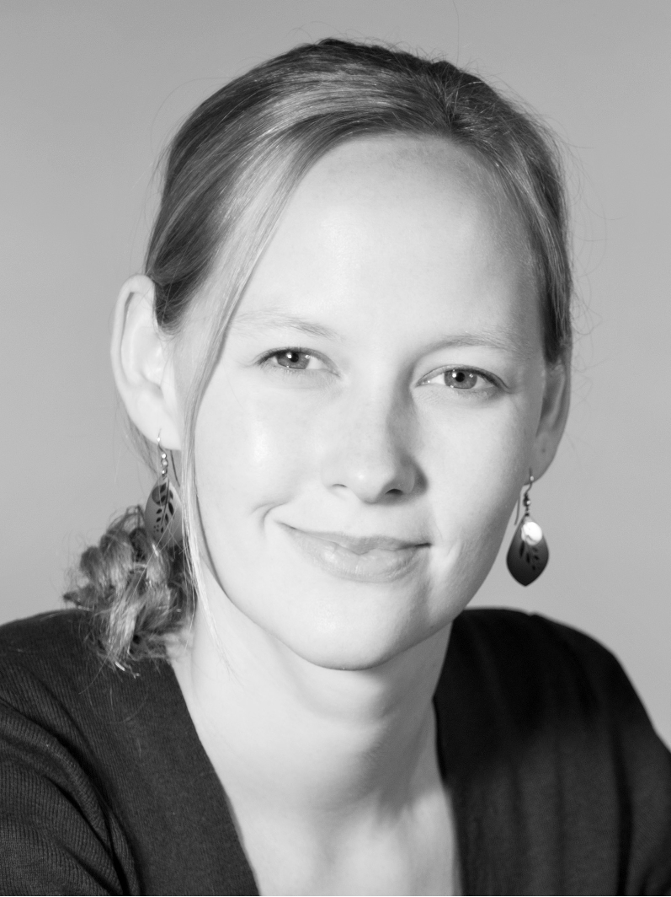
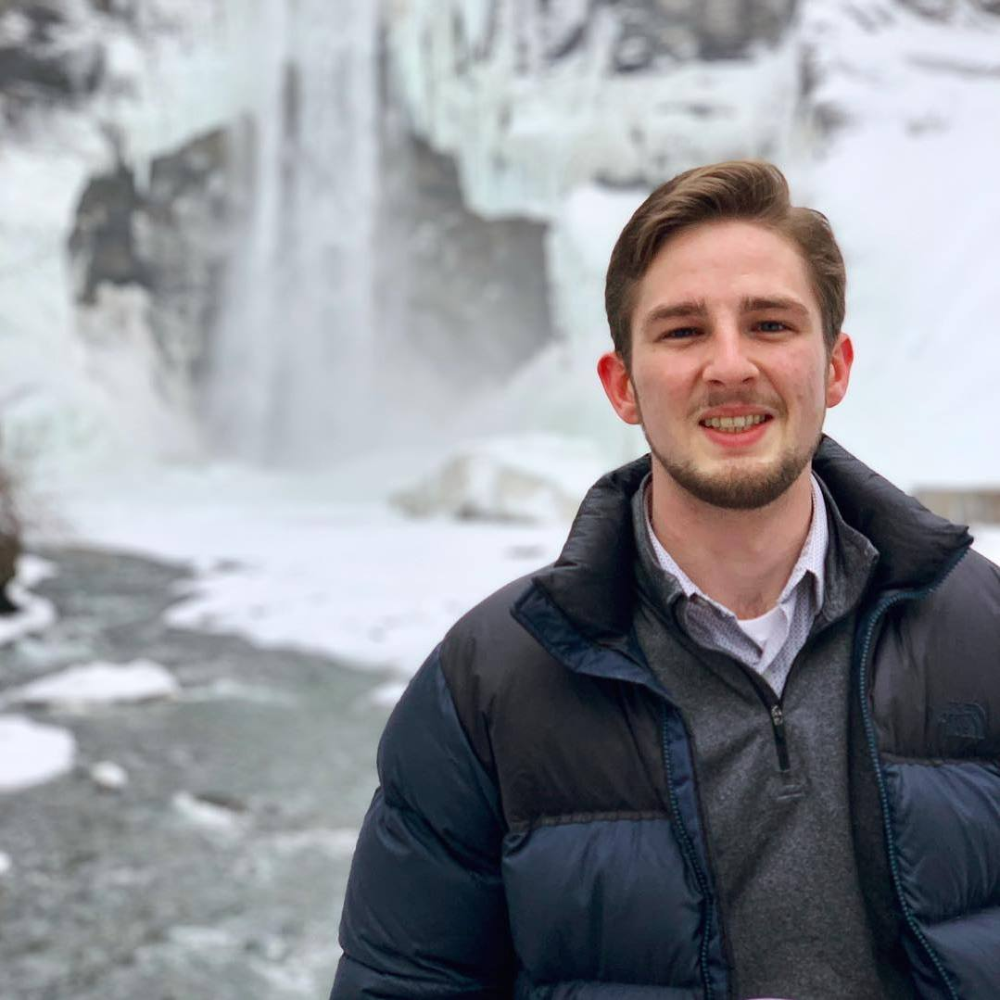
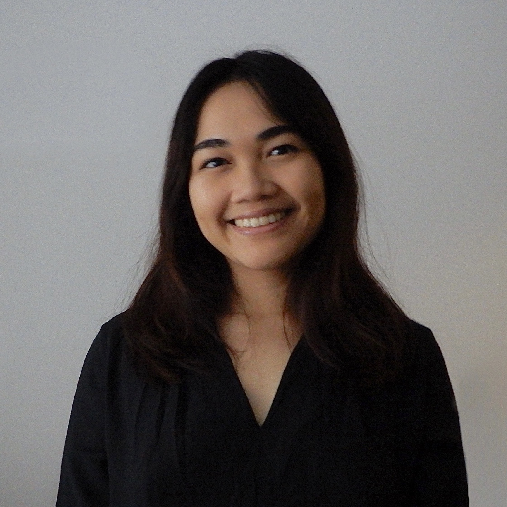

# Fast Robots @Cornell, Spring 2023
[Return to main page](index.md)

## Teaching Team

### Professor Kirstin Petersen (she/her)

Kirstin is an assistant professor at Cornell in the department of Electrical and Computer Engineering, with field memberships in CS, MAE, and SYSEN. She regularly teaches [Fast Robots](https://cei.ece.cornell.edu/teaching-2/ece-4160-fr/) and [ECE 6680 Multi-Agent Systems](https://cei.ece.cornell.edu/teaching-2/teaching/). When she is not teaching she runs the [Collective Embodied Intelligence Lab](https://cei.ece.cornell.edu/), which covers research on design and coordination of large robot collectives able to achieve complex behaviors beyond the reach of single robot systems, and corresponding studies on how social insects do so in nature. Before Cornell, Kirstin did a postdoc at the Max Planck Institute for Intelligent Systems in Germany, and a doctorate in Computer Science at Harvard University. In her spare time, Kirstin loves to hang out with her sons, kayak, and build more robots.  

### Jonathan Jaramillo (he/him)

Jonathan is an ECE graduate student working in the Collective Embodied Intelligence Lab under Kirstin Petersen. Having grown up near Ithaca, his research is focused on developing computer vision systems to help improve vineyard management techniques for grape growers here in the Finger Lakes region, and around the world. When he’s not in the vineyard collecting data or testing a new computer vision system, he can often be found in the lab tinkering with robots or developing CV systems for studying social insect behavior.  Jonathan received a Bachelor of Science in physics and computer science from Houghton College and spent some time working as a systems engineer for Lockheed Martin.  

### Alex Coy (he/him)

Alex Coy is an ECE graduate student in Prof Molnar's lab with a focus on mmWave radio design. Outside of academics, he enjoys cooking, making music, and audiovisual production. Some of his favorite achievements have been being the unofficial "Barbecue Dad" for the Big Red Marching Band and baking Chicago-style deep dish pizzas that disappear within two minutes of being near college students.

### Cameron Urban (he/him)

Cameron Urban is an MAE graduate student in Dr. Farrell Helbling's lab. His research is focused on bio-inspired aerial robots. He received a Bachelor of Science in mechanical engineering from Washington University in St. Louis. In the past, he has spent time researching bat flight at Brown University, engineering space systems at MIT Lincoln Laboratory, and working with hardware-focused startups in Shenzhen, China. When not working, Cameron enjoys contributing to open-source software projects, scuba diving, and getting beaten in chess.

### Anya Prabowo (She/her)

Anya Prabowo is an ECE MEng student with an academic interest in computer architecture - and more recently robotics.

### L.M. Nawrocki "Lemon" (they/them)

L.M. Nawrocki, who also goes by Lemon, is a senior studying Mechanical Engineering at Cornell and minoring in Robotics. In their spare time they also do research in Prof. Napp's lab. For fun, Lemon enjoys skiing, snowboarding, sewing, and indoor rock climbing.

### Joseph Horwitz (he/him)

Joseph Horwitz is a Junior ECE student with a minor in CS. Hometown Washington D.C, he plays ultimate frisbee and ice hockey. He is interested in embedded systems engineering.

### Ryan Chan (he/him)

Ryan Chan is a senior majoring in ECE and minoring in CS. In his spare time he is also in the Cornell Archery Club, on the Cornell EWH project team, and does research in the Organic Robotics (Shepherd) Lab during the school year and Space Systems Design (Peck) Lab during the Summer. He is interested in embedded systems, PCB design, and robots. He also like turtles.

